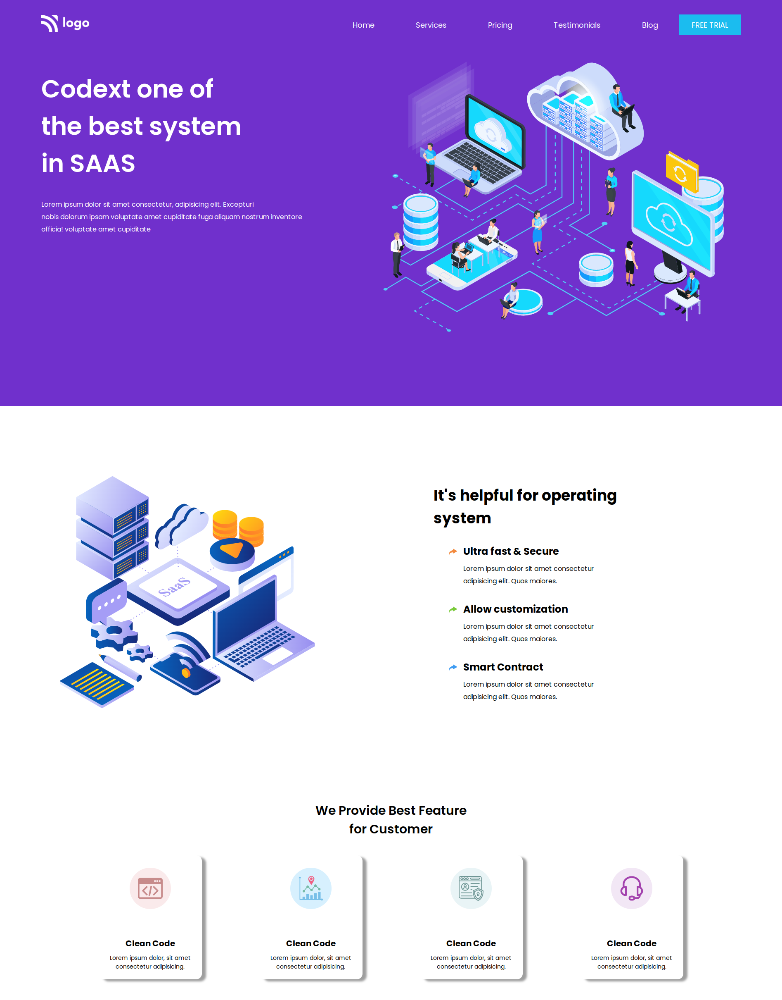

# Project 13

### `Nishok Maharaaj`

## Learnings    

This is the thirteenth project of HTML and CSS class where I done the webpage with `position`, `flex-box`. The position `sticky` is used for the navigation menu and also made cards with images mostly using. Made the site mobile responsive using `@media-queries`.

[Project Live Link](https://nishok-html-css-proj13.netlify.app/)

## Efforts

This project took around 5 hours to build the webpage which has cards and to position images.

### Screenshot

